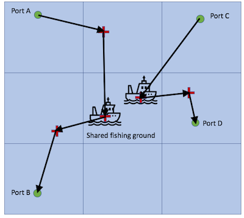

# Goal
* Identify vessels that routinely display much lower observed marginal revenue/cost ratios than similar vessels fishing in the same area at the same time (*i.e.*, they are behaving in a way that routinely appears to be less profitable than other similar vessels)

# Assumptions
* For a given fishing ground and time period (*e.g.*, monthly), all vessels with the same gear type and flag are fishing the same stock (with biomass $B_g$) and share the same catchability ($q_g$)
* Fishing grounds for each flag and gear type will be defined using either arbitrary lat/lon grid cells (*e.g.*, 0.1 x 0.1 degrees), or density based fishing activity clustering as described by Ester et al. 1996 using the `fpc` R package
* Catch is proportional to $B_g$, $q_g$, and effort $E_n,g$ where effort is defined in units in *kWH* (see Sala et al. 2018) - more powerful boats catch more fish for a given time spent fishing
* All vessels with the same gear type and flag have the same variable labor cost, variable fuel cost, and variable subsidy benefits. Units for each of these are in terms of *USD/kWH* - more powerful boats spend more money on labor (*i.e.*, have larger crew sizes), have higher engine fuel consumption rates, and have larger subsidy benefits (see Sala et al. 2018)
* On average, all vessels with the same gear type and flag operating under these assumptions should have similar marginal revenue/cost ratios for a given fishing ground and time period - they are subject to the same economic dynamics and management regime
* However,vessels employing forced labor will routinely display much lower observed marginal revenue/cost ratios compared to the average of similar vessels fishing in the same area at the same time. "Routinely" is defined as more than 50% of fishing activity, and "much lower" is defined as more than two standard deviations below the mean

# Model setup

* $N$ fishing vessels of the same flag and gear type each fish in $G_n$ different fishing grounds, but all fish together is the same fishing ground $g$
* Each fishing vessel $n$ has a marginal revenue for visiting each additional fishing ground, as well as a marginal cost
* The marginal revenue is defined as the catch in that fishing ground multiplied by the price
* The marginal cost is defined as the fishing cost in that fishing ground, as well as the additional travel cost from the previous fishing ground plus the hypothetical travel cost for traveling directly to the final trip port. Costs are in terms of *USD/kWH*
* To calculate the hypothetical travel cost for traveling to the final port, we will first find the minimum distance between all locations and ports globally from the GFW data set, and then divide this distance by the average speed for a given vessel. This will represent the minimum hypothetical time, which can then be converted to travel effort by multiplying by engine power. This is a conservative estimate (this will cause marginal revenue/cost ratio to be higher than what is likely)
* A "trip" is defined as all fishing and travel activity between two port visits. Each trip may include one or more transshipment and/or bunkering events  

  

# Equations

## Marginal revenue

Marginal revenue of vessel *n* in fishing ground *g* is defined as follows:
$$R_{n,g} = q_g B_g E_{n,g} p_g$$

Where $q_g$ is catchability in patch $g$, $B_g$ is the stock biomass in *MT*, $p_g$ is price per unit volume in *USD/MT*, and $E_n$ is fishing effort in *kWH*.

## Marginal cost

Marginal variable cost of fishing vessel $n$ in fishing grid cell $g$ is defined as follows:
$$C_{n,g} = (T_{n,g} + E_{n,g})(c_{fuel} + c_{labor} - s)$$

Where $T_{n,g}$ is the travel effort for that fishing ground in *kWH*, $c_{fuel}$ is variable fuel cost in $\frac{USD}{kWH}$, $c_{labor}$ is variable labor cost in $\frac{USD}{kWH}$, and $s$ is variable subsidy benfit in $\frac{USD}{kWH}$.

Travel effort for a given fishing ground is defined as the sum of travel effort from the previous fishing ground or port plus the hypothetical travel effort to the final port:

$$T_{n,g} = T_{n,g-1} + T_{n,G+1}$$

## Marginal revenue/cost ratio

For every vessel and fishing ground, determine whether the ratio of marginal revenue/cost is less than two standard deviations below the mean ratio across all vessels by determining if the following inequality holds true:

$$\frac{R_{n,g}}{C_{n,g}} \ll \overline{\frac{R_{g}}{C_{g}}}$$

Writing out this inequality yields the following:

$$\frac{q_g B_g E_{n,g} p_g}{(T_{n,g} + E_{n,g})(c_{fuel} + c_{labor} - s)} \ll \overline{\frac{q_g B_g E_{g} p_g}{(T_{g} + E_{g})(c_{fuel} + c_{labor} - s)}}$$

Which can be simplified as follows. This inequality needs information only on fishing effort and travel effort:

$$\frac{E_{n,g}}{T_{n,g} + E_{n,g}} \ll \overline{\frac{E_{g}}{T_{g} + E_{g}}}$$

Finally, for every fishing vessel over a single year time frame, determine the fraction of fishing grounds for which the above inequality holds true. If this number is greater than 50%, the vessel is labeled as risky for potentially employing forced labor.